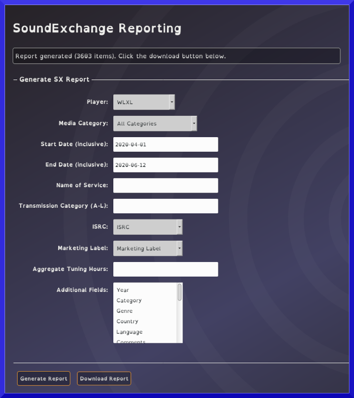

* TOC
{:toc}

## Sound Exchange Reports

Log analysis and royality reports for Sound Exchange, SOCAN

After running report and downloading locally the CSV file, make sure you select UTF-8 as the character set (if it asks). This is the case when opening in LibreOffice at least. Opening in Google Sheets doesn’t ask for character set

Reports are generated as a CSV file. When stations upload reports to SX they must be in xlxs. Otherwise will fail on older xls/97/2003

{: .Reports}
